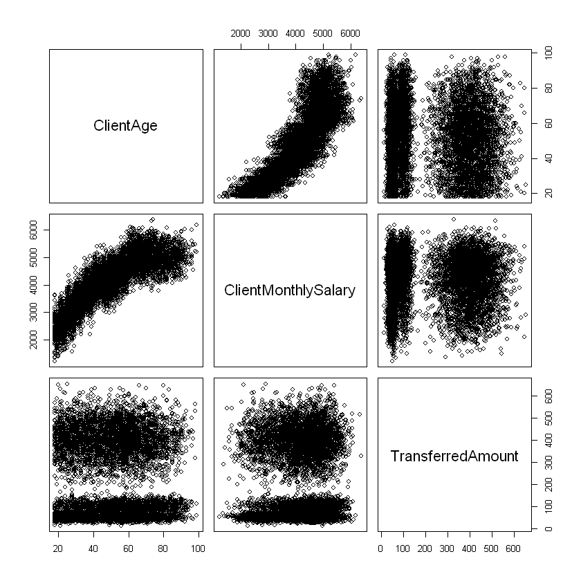
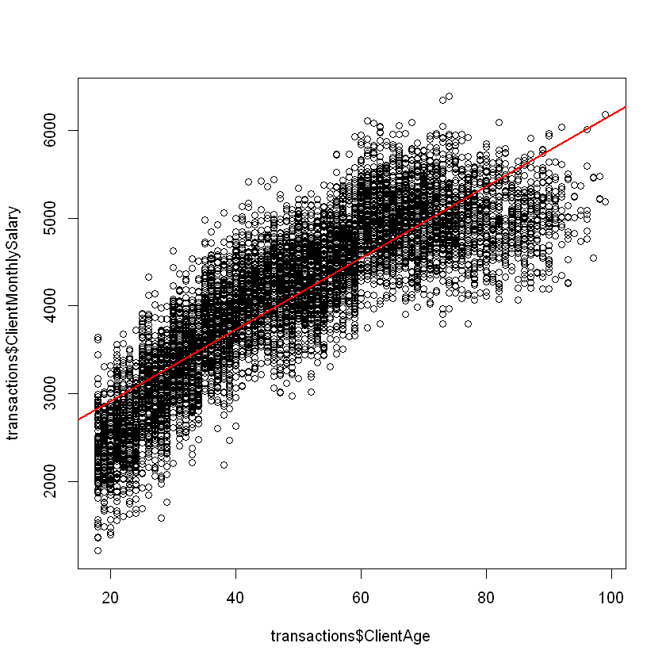
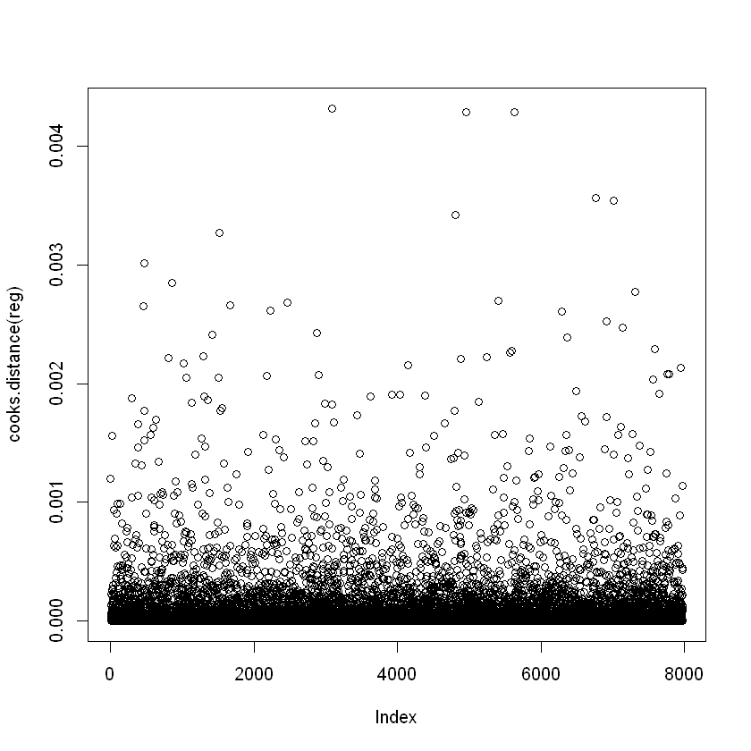

  # Transactions Multiple Regression-Correlation

## 1. Import required libraries


```R
if(!is.element("devtools", installed.packages()[,1])){
  install.packages("devtools")
}

if(!is.element("DBI", installed.packages()[,1])){
  devtools::install_github("rstats-db/DBI")
}

if(!is.element("RPostgres", installed.packages()[,1])){
  devtools::install_github("rstats-db/RPostgres")
}

library(RPostgres)
library(DBI)
```

## 2. Load data from Database using SQL query


```R
con <- dbConnect(RPostgres::Postgres(), host='localhost', port='5433', dbname='bandit-nbs', user='bandit', password="orF9YuPWVajej5tC6cfiro94BoxrzsoE")
transactions <- dbGetQuery(con, 'SELECT * FROM "Transaction"')
rownames(transactions) <- transactions$Id
summary(transactions)
transactions_numeric <- transactions[, sapply(transactions, is.numeric)]
```


          Id             DebitBank          CreditBank          ClientId        
     Length:7980        Length:7980        Length:7980        Length:7980       
     Class :character   Class :character   Class :character   Class :character  
     Mode  :character   Mode  :character   Mode  :character   Mode  :character  
                                                                                
                                                                                
                                                                                
     ClientGender       ClientBirthDate                      ClientAge    
     Length:7980        Min.   :1930-01-05 18:15:45.0000   Min.   :18.00  
     Class :character   1st Qu.:1948-07-24 10:45:09.2500   1st Qu.:34.00  
     Mode  :character   Median :1967-12-17 18:49:19.5000   Median :50.00  
                        Mean   :1968-01-07 03:15:07.1164   Mean   :49.93  
                        3rd Qu.:1987-09-27 16:49:25.5000   3rd Qu.:64.00  
                        Max.   :2005-12-28 21:36:53.0000   Max.   :99.00  
     ClientMaritalStatus ClientMonthlySalary TransactionDate                 
     Length:7980         Min.   :1208        Min.   :2022-12-31 23:26:55.50  
     Class :character    1st Qu.:3520        1st Qu.:2023-02-01 21:00:34.05  
     Mode  :character    Median :4271        Median :2023-03-05 21:55:26.77  
                         Mean   :4137        Mean   :2023-03-05 13:39:06.27  
                         3rd Qu.:4847        3rd Qu.:2023-04-06 13:17:36.00  
                         Max.   :6392        Max.   :2023-05-07 08:15:15.89  
     MerchantActivity   AuthenticationMethod TransferredAmount
     Length:7980        Length:7980          Min.   : 12.0    
     Class :character   Class :character     1st Qu.: 56.0    
     Mode  :character   Mode  :character     Median :120.0    
                                             Mean   :224.8    
                                             3rd Qu.:396.0    
                                             Max.   :653.0    


As we can see in the summary, the columns are correctly interpreted, we can continue

## 3. Plot all regression-correlation


```R
plot(transactions_numeric)
```


    

    


Based on this visual result we can definetly see that there is a correlation between the ClientAge and the ClientMonthlySalary variables
But let's do a multiple regression correlation to be a little bit more precise


```R
reg <- lm(transactions$ClientAge ~ transactions$ClientMonthlySalary + transactions$TransferredAmount)
summary(reg)
```


    
    Call:
    lm(formula = transactions$ClientAge ~ transactions$ClientMonthlySalary + 
        transactions$TransferredAmount)
    
    Residuals:
        Min      1Q  Median      3Q     Max 
    -30.150  -6.888  -0.969   5.572  41.023 
    
    Coefficients:
                                       Estimate Std. Error t value Pr(>|t|)    
    (Intercept)                      -2.253e+01  5.376e-01 -41.910   <2e-16 ***
    transactions$ClientMonthlySalary  1.749e-02  1.242e-04 140.774   <2e-16 ***
    transactions$TransferredAmount    5.100e-04  6.445e-04   0.791    0.429    
    ---
    Signif. codes:  0 '***' 0.001 '**' 0.01 '*' 0.05 '.' 0.1 ' ' 1
    
    Residual standard error: 10.14 on 7977 degrees of freedom
    Multiple R-squared:  0.7139,	Adjusted R-squared:  0.7138 
    F-statistic:  9951 on 2 and 7977 DF,  p-value: < 2.2e-16
    


As we can see, the summary of the model indicates that the **p-value for the ClientMonthlySalary is very low (2e-16)**,
thus we can reject the null hypothesis that says that there's no correlation between the ClientAge and the ClientMonthlySalary

On the other side, **the p-value for the TransferredAmount is not negligeable (0.429)**, thus we won't reject the null hypothesis.
Based on this we can't say that there's a correlation between the Age and the TransferredAmount

Moreover, the R² value (0.7139) shows us that our model is quite good, but maybe we could do better if we hecked the AIC Criteria


```R
step(reg)
```

    Start:  AIC=36969.19
    transactions$ClientAge ~ transactions$ClientMonthlySalary + transactions$TransferredAmount
    
                                       Df Sum of Sq     RSS   AIC
    - transactions$TransferredAmount    1        64  819747 36968
    <none>                                           819683 36969
    - transactions$ClientMonthlySalary  1   2036348 2856031 46928
    
    Step:  AIC=36967.82
    transactions$ClientAge ~ transactions$ClientMonthlySalary
    
                                       Df Sum of Sq     RSS   AIC
    <none>                                           819747 36968
    - transactions$ClientMonthlySalary  1   2045030 2864777 46951
    


    
    Call:
    lm(formula = transactions$ClientAge ~ transactions$ClientMonthlySalary)
    
    Coefficients:
                         (Intercept)  transactions$ClientMonthlySalary  
                           -22.44236                           0.01749  
    


Here the difference is very small, but it seems that the model is just a little bit better if it only takes into account ClientAge and ClientMonthlySalary

(From **AIC 36969.19 to 36967.82**)

Let's update our model and plot it !


```R
reg <- lm(transactions$ClientMonthlySalary ~ transactions$ClientAge)
plot(transactions$ClientMonthlySalary ~ transactions$ClientAge)
abline(reg, col="red", lwd=2)
```


    

    


We can also check for the residuals in order to adjust correctly our model


```R
plot(cooks.distance(reg))
```


    

    


All Cook distances are below 1, so there's no points perturbing the model
