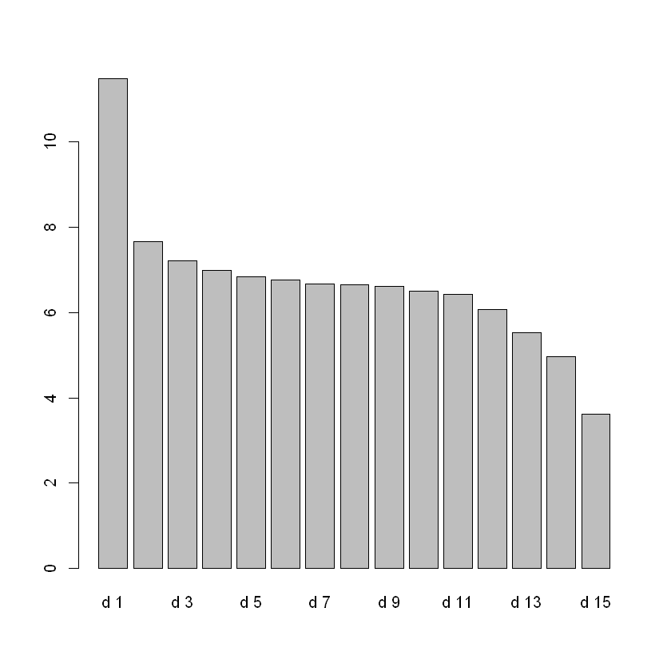
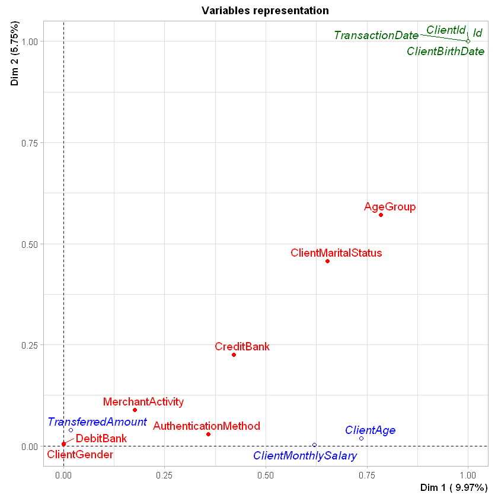

  # Transactions MCA

## 1. Import required libraries


```R
if(!is.element("FactoMineR", installed.packages()[,1])){
  install.packages("FactoMineR", dependencies=TRUE)
}

if(!is.element("factoextra", installed.packages()[,1])){
  install.packages("factoextra", dependencies=TRUE)
}

if(!is.element("devtools", installed.packages()[,1])){
  install.packages("devtools")
}

if(!is.element("DBI", installed.packages()[,1])){
  devtools::install_github("rstats-db/DBI")
}

if(!is.element("RPostgres", installed.packages()[,1])){
  devtools::install_github("rstats-db/RPostgres")
}

library(FactoMineR)
library(factoextra)
library(RPostgres)
library(DBI)
```

    Loading required package: ggplot2
    
    Welcome! Want to learn more? See two factoextra-related books at https://goo.gl/ve3WBa
    
    

## 2. Load data from Database using SQL query


```R
con <- dbConnect(RPostgres::Postgres(), host='localhost', port='5433', dbname='bandit-nbs', user='bandit', password="orF9YuPWVajej5tC6cfiro94BoxrzsoE")
transactions <- dbGetQuery(con, 'SELECT * FROM "Transaction"')
rownames(transactions) <- transactions$Id

transactions[,"DebitBank"] = factor(transactions[,"DebitBank"])
transactions[,"CreditBank"] = factor(transactions[,"CreditBank"])
transactions[,"ClientGender"] = factor(transactions[,"ClientGender"])
transactions[,"ClientMaritalStatus"] = factor(transactions[,"ClientMaritalStatus"])
transactions[,"MerchantActivity"] = factor(transactions[,"MerchantActivity"])
transactions[,"AuthenticationMethod"] = factor(transactions[,"AuthenticationMethod"])

summary(transactions)
```


          Id                        DebitBank                CreditBank  
     Length:7980        bandit-donsaluste:2351   bandit-donsaluste:2421  
     Class :character   bandit-picsou    :1555   bandit-picsou    :1849  
     Mode  :character   bandit-profit    :3245   bandit-profit    :2544  
                        bandit-radinou   : 829   bandit-radinou   :1166  
                                                                         
                                                                         
       ClientId         ClientGender  ClientBirthDate                   
     Length:7980        Female:4135   Min.   :1930-01-01 00:07:35.0000  
     Class :character   Male  :3845   1st Qu.:1948-11-24 20:16:43.2500  
     Mode  :character                 Median :1967-06-06 23:39:13.0000  
                                      Mean   :1967-10-29 08:20:56.6039  
                                      3rd Qu.:1986-09-11 19:28:55.0000  
                                      Max.   :2005-12-18 09:24:07.0000  
       ClientAge     ClientMaritalStatus ClientMonthlySalary
     Min.   :18.00   Divorced: 953       Min.   :1208       
     1st Qu.:34.00   Married :3515       1st Qu.:3520       
     Median :50.00   Single  :2926       Median :4271       
     Mean   :49.93   Widowed : 586       Mean   :4137       
     3rd Qu.:64.00                       3rd Qu.:4847       
     Max.   :99.00                       Max.   :6392       
     TransactionDate                       MerchantActivity AuthenticationMethod
     Min.   :2022-12-31 23:12:34.65   Brass Animals:1515    EMAIL:1630          
     1st Qu.:2023-02-04 11:53:39.80   Dachshunds   :3753    ID   :1877          
     Median :2023-03-10 17:37:25.75   Trading Cards:2712    OTP  :2906          
     Mean   :2023-03-09 21:01:15.75                         SMS  :1567          
     3rd Qu.:2023-04-12 09:25:26.74                                             
     Max.   :2023-05-14 16:59:47.38                                             
     TransferredAmount
     Min.   : 12.0    
     1st Qu.: 56.0    
     Median :120.0    
     Mean   :224.8    
     3rd Qu.:396.0    
     Max.   :653.0    


After a little bit of casting, our data is correctly parsed and can be used to do an ACM

## 3. Launch the MCA algorithm

The ACM algorithm is quite long to process (~10min)


```R
acm <- MCA(transactions, graph=FALSE, quanti.sup=c("ClientAge","ClientMonthlySalary","TransferredAmount"), quali.sup=c("Id", "ClientId", "ClientBirthDate","TransactionDate"))
```

First, we can check for the eigen values to see what is the repartition of explanation between our dimensions


```R
acm$eig
```


<table class="dataframe">
<caption>A matrix: 15 × 3 of type dbl</caption>
<thead>
	<tr><th></th><th scope=col>eigenvalue</th><th scope=col>percentage of variance</th><th scope=col>cumulative percentage of variance</th></tr>
</thead>
<tbody>
	<tr><th scope=row>dim 1</th><td>0.28719820</td><td>11.487928</td><td> 11.48793</td></tr>
	<tr><th scope=row>dim 2</th><td>0.19168044</td><td> 7.667218</td><td> 19.15515</td></tr>
	<tr><th scope=row>dim 3</th><td>0.18019893</td><td> 7.207957</td><td> 26.36310</td></tr>
	<tr><th scope=row>dim 4</th><td>0.17469590</td><td> 6.987836</td><td> 33.35094</td></tr>
	<tr><th scope=row>dim 5</th><td>0.17079516</td><td> 6.831807</td><td> 40.18275</td></tr>
	<tr><th scope=row>dim 6</th><td>0.16928633</td><td> 6.771453</td><td> 46.95420</td></tr>
	<tr><th scope=row>dim 7</th><td>0.16659448</td><td> 6.663779</td><td> 53.61798</td></tr>
	<tr><th scope=row>dim 8</th><td>0.16635918</td><td> 6.654367</td><td> 60.27235</td></tr>
	<tr><th scope=row>dim 9</th><td>0.16546908</td><td> 6.618763</td><td> 66.89111</td></tr>
	<tr><th scope=row>dim 10</th><td>0.16261919</td><td> 6.504767</td><td> 73.39588</td></tr>
	<tr><th scope=row>dim 11</th><td>0.16073774</td><td> 6.429510</td><td> 79.82539</td></tr>
	<tr><th scope=row>dim 12</th><td>0.15167531</td><td> 6.067012</td><td> 85.89240</td></tr>
	<tr><th scope=row>dim 13</th><td>0.13821458</td><td> 5.528583</td><td> 91.42098</td></tr>
	<tr><th scope=row>dim 14</th><td>0.12428102</td><td> 4.971241</td><td> 96.39222</td></tr>
	<tr><th scope=row>dim 15</th><td>0.09019445</td><td> 3.607778</td><td>100.00000</td></tr>
</tbody>
</table>


We can also plot those repartitions


```R
barplot(acm$eig[,2], names=paste("d",1:nrow(acm$eig)))
```


    

    


## 4. MCA variables factor map

First let's plot our acm with the following options
- **cex=0.8** : Size of the points
- **invisible=c("ind","quali.sup","quanti.sup")** : We only want to plot the variables on the graph


```R
plot(acm, invisible = c("ind", "quali.sup", "quanti.sup"), cex = 0.8)
```

    Warning message:
    "ggrepel: 2 unlabeled data points (too many overlaps). Consider increasing max.overlaps"
    


    

    


Based on this graph, it's quite hard to see groups and interpret the relations between
the axes and our variables. In order to see a little bit clearer, we could pass
to the next graph


```R
plot(acm, choix="var")
```


    

    


Here, we can't say much for the horizontal axis. By contrast, the vertical axis seems a little bit more interseting
in our case. We can see that it's mainly built from the MerchantActivity and the ClientMaritalStatus

When we inspect the previous graph, we may find that the Brass Animals seems to be related to the Widowed persons.
To further investigate this hypothesis, we could take advantage of the plotellipses function


```R
plotellipses(acm, keepvar = c("ClientMaritalStatus","MerchantActivity"), label="none")
```


    

    


More than the Brass Animals only linked to the Widowed persons, we may see that the repartition of
the points seems to indicate a possible correlation between the MaritalStatus and the MerchantActivity

In order to prove this correlation, we could use the CHI-SQUARE method


```R
chisq.test(transactions$ClientMaritalStatus,transactions$MerchantActivity)
```


    
    	Pearson's Chi-squared test
    
    data:  transactions$ClientMaritalStatus and transactions$MerchantActivity
    X-squared = 1170.6, df = 6, p-value < 2.2e-16
    


Based on the p-value, we can definitely say that there's a correlation between the ClientMaritalStatus and the MerchantActivity


```R
contingency_table <- table(transactions$ClientMaritalStatus, transactions$MerchantActivity)
mosaicplot(contingency_table, color = TRUE)
```


    

    


```R
library(ggplot2)

ggplot(transactions, aes(x = ClientMaritalStatus, fill = MerchantActivity)) + geom_bar()
```


    

    


```R
age_groups <- c("<20", "20-24", "25-29", "30-34", "35-39", "40-44", "45-49", "50-54", "55-59", ">=60")
bounds <- c(0, 20, 24, 29, 34, 39, 44, 49, 54, 59, Inf)
AgeGroup <- unlist(lapply(seq_len(nrow(transactions)), function(i) { cut(transactions$ClientAge[i], breaks = bounds, labels = age_groups) }))
transactions$AgeGroup <- AgeGroup
```


```R
acm <- MCA(transactions, graph=FALSE, quanti.sup=c("ClientAge","ClientMonthlySalary","TransferredAmount"), quali.sup=c("Id", "ClientId", "ClientBirthDate","TransactionDate"))
```


```R
acm$eig
```


<table class="dataframe">
<caption>A matrix: 24 × 3 of type dbl</caption>
<thead>
	<tr><th></th><th scope=col>eigenvalue</th><th scope=col>percentage of variance</th><th scope=col>cumulative percentage of variance</th></tr>
</thead>
<tbody>
	<tr><th scope=row>dim 1</th><td>0.34180901</td><td>9.969429</td><td>  9.969429</td></tr>
	<tr><th scope=row>dim 2</th><td>0.19725741</td><td>5.753341</td><td> 15.722771</td></tr>
	<tr><th scope=row>dim 3</th><td>0.17211559</td><td>5.020038</td><td> 20.742809</td></tr>
	<tr><th scope=row>dim 4</th><td>0.16388274</td><td>4.779913</td><td> 25.522722</td></tr>
	<tr><th scope=row>dim 5</th><td>0.15422338</td><td>4.498182</td><td> 30.020904</td></tr>
	<tr><th scope=row>dim 6</th><td>0.15090655</td><td>4.401441</td><td> 34.422345</td></tr>
	<tr><th scope=row>dim 7</th><td>0.14867963</td><td>4.336489</td><td> 38.758834</td></tr>
	<tr><th scope=row>dim 8</th><td>0.14717151</td><td>4.292502</td><td> 43.051337</td></tr>
	<tr><th scope=row>dim 9</th><td>0.14556336</td><td>4.245598</td><td> 47.296935</td></tr>
	<tr><th scope=row>dim 10</th><td>0.14409395</td><td>4.202740</td><td> 51.499675</td></tr>
	<tr><th scope=row>dim 11</th><td>0.14308279</td><td>4.173248</td><td> 55.672923</td></tr>
	<tr><th scope=row>dim 12</th><td>0.14187830</td><td>4.138117</td><td> 59.811040</td></tr>
	<tr><th scope=row>dim 13</th><td>0.14125358</td><td>4.119896</td><td> 63.930936</td></tr>
	<tr><th scope=row>dim 14</th><td>0.13993710</td><td>4.081499</td><td> 68.012435</td></tr>
	<tr><th scope=row>dim 15</th><td>0.13866947</td><td>4.044526</td><td> 72.056961</td></tr>
	<tr><th scope=row>dim 16</th><td>0.13643008</td><td>3.979211</td><td> 76.036171</td></tr>
	<tr><th scope=row>dim 17</th><td>0.13440772</td><td>3.920225</td><td> 79.956397</td></tr>
	<tr><th scope=row>dim 18</th><td>0.12625186</td><td>3.682346</td><td> 83.638743</td></tr>
	<tr><th scope=row>dim 19</th><td>0.11974899</td><td>3.492679</td><td> 87.131421</td></tr>
	<tr><th scope=row>dim 20</th><td>0.11797419</td><td>3.440914</td><td> 90.572335</td></tr>
	<tr><th scope=row>dim 21</th><td>0.10760788</td><td>3.138563</td><td> 93.710899</td></tr>
	<tr><th scope=row>dim 22</th><td>0.09712785</td><td>2.832896</td><td> 96.543794</td></tr>
	<tr><th scope=row>dim 23</th><td>0.07969973</td><td>2.324576</td><td> 98.868370</td></tr>
	<tr><th scope=row>dim 24</th><td>0.03879875</td><td>1.131630</td><td>100.000000</td></tr>
</tbody>
</table>


```R
barplot(acm$eig[,2], names=paste("d",1:nrow(acm$eig)))
```


    

    


```R
plot(acm, invisible = c("ind", "quali.sup", "quanti.sup"), cex = 0.8)
```

    Warning message:
    "ggrepel: 3 unlabeled data points (too many overlaps). Consider increasing max.overlaps"
    


    

    


```R
plot(acm, choix="var")
```


    

    


```R
plotellipses(acm, keepvar = c("ClientMaritalStatus","AgeGroup","CreditBank"), label="none")
```


    

    


```R
boxplot(transactions$ClientAge~transactions$CreditBank)
```


    

    


```R
model <- lm(transactions$ClientAge~transactions$CreditBank)
anova(model)
```


<table class="dataframe">
<caption>A anova: 2 × 5</caption>
<thead>
	<tr><th></th><th scope=col>Df</th><th scope=col>Sum Sq</th><th scope=col>Mean Sq</th><th scope=col>F value</th><th scope=col>Pr(&gt;F)</th></tr>
	<tr><th></th><th scope=col>&lt;int&gt;</th><th scope=col>&lt;dbl&gt;</th><th scope=col>&lt;dbl&gt;</th><th scope=col>&lt;dbl&gt;</th><th scope=col>&lt;dbl&gt;</th></tr>
</thead>
<tbody>
	<tr><th scope=row>transactions$CreditBank</th><td>   3</td><td> 683507.6</td><td>227835.8771</td><td>833.1015</td><td> 0</td></tr>
	<tr><th scope=row>Residuals</th><td>7976</td><td>2181269.6</td><td>   273.4791</td><td>      NA</td><td>NA</td></tr>
</tbody>
</table>


```R
pairwise.t.test(transactions$ClientAge, transactions$CreditBank, p.adjust.method = "none", pool.sd = T)
```


    
    	Pairwise comparisons using t tests with pooled SD 
    
    data:  transactions$ClientAge and transactions$CreditBank 
    
                   bandit-donsaluste bandit-picsou bandit-profit
    bandit-picsou  < 2e-16           -             -            
    bandit-profit  < 2e-16           < 2e-16       -            
    bandit-radinou < 2e-16           5.6e-11       < 2e-16      
    
    P value adjustment method: none 


```R
library(ggplot2)
library(dplyr)
counts <- transactions %>% count(ClientAge, CreditBank)
ggplot(counts, aes(x = ClientAge, y = n, fill = CreditBank)) + geom_col()
```

    
    Attaching package: 'dplyr'
    
    
    The following objects are masked from 'package:stats':
    
        filter, lag
    
    
    The following objects are masked from 'package:base':
    
        intersect, setdiff, setequal, union
    
    
    


    

    

