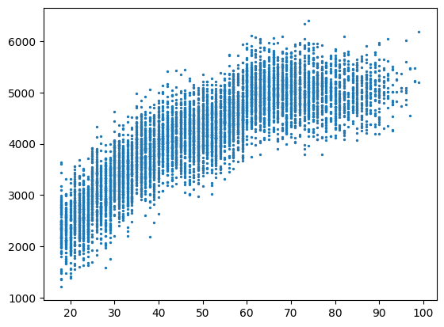
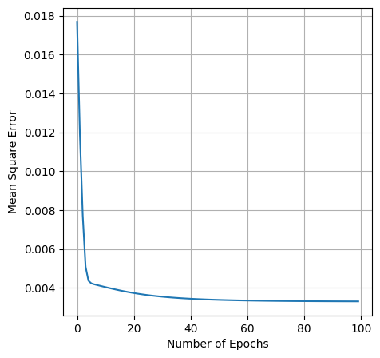
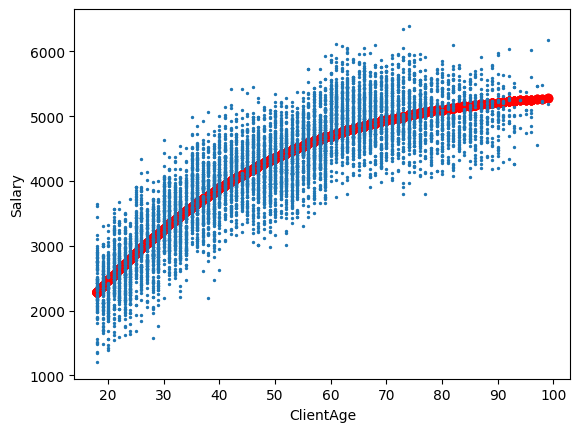

## 1. Load data from Database using SQL query


```python
import pandas as pd
import psycopg2

conn = psycopg2.connect(host="localhost",database="bandit-nbs",port="5433",user="bandit",password="orF9YuPWVajej5tC6cfiro94BoxrzsoE")
cursor = conn.cursor()
cursor.execute("SELECT * FROM \"Transaction\"")
df = pd.DataFrame(cursor.fetchall(), columns=[desc[0] for desc in cursor.description])
cursor.close()
conn.close()
```


    ---------------------------------------------------------------------------

    OperationalError                          Traceback (most recent call last)

    Cell In[1], line 4
          1 import pandas as pd
          2 import psycopg2
    ----> 4 conn = psycopg2.connect(host="localhost",database="bandit-nbs",port="5433",user="bandit",password="orF9YuPWVajej5tC6cfiro94BoxrzsoE")
          5 cursor = conn.cursor()
          6 cursor.execute("SELECT * FROM \"Transaction\"")
    

    File C:\Program Files\Python311\Lib\site-packages\psycopg2\__init__.py:122, in connect(dsn, connection_factory, cursor_factory, **kwargs)
        119     kwasync['async_'] = kwargs.pop('async_')
        121 dsn = _ext.make_dsn(dsn, **kwargs)
    --> 122 conn = _connect(dsn, connection_factory=connection_factory, **kwasync)
        123 if cursor_factory is not None:
        124     conn.cursor_factory = cursor_factory
    

    OperationalError: connection to server at "localhost" (::1), port 5433 failed: Connection refused (0x0000274D/10061)
    	Is the server running on that host and accepting TCP/IP connections?
    connection to server at "localhost" (127.0.0.1), port 5433 failed: Connection refused (0x0000274D/10061)
    	Is the server running on that host and accepting TCP/IP connections?
    


```python
df.head()
```


<div>
<style scoped>
    .dataframe tbody tr th:only-of-type {
        vertical-align: middle;
    }

    .dataframe tbody tr th {
        vertical-align: top;
    }

    .dataframe thead th {
        text-align: right;
    }
</style>
<table border="1" class="dataframe">
  <thead>
    <tr style="text-align: right;">
      <th></th>
      <th>Id</th>
      <th>DebitBank</th>
      <th>CreditBank</th>
      <th>ClientId</th>
      <th>ClientGender</th>
      <th>ClientBirthDate</th>
      <th>ClientAge</th>
      <th>ClientMaritalStatus</th>
      <th>ClientMonthlySalary</th>
      <th>TransactionDate</th>
      <th>MerchantActivity</th>
      <th>AuthenticationMethod</th>
      <th>TransferredAmount</th>
    </tr>
  </thead>
  <tbody>
    <tr>
      <th>0</th>
      <td>46ec99c4-3af0-49d3-9d06-2dfed9797a9d</td>
      <td>bandit-picsou</td>
      <td>bandit-profit</td>
      <td>8b6ed1a0-dedc-43f4-99fe-7fd7e9fc1b7a</td>
      <td>Female</td>
      <td>2000-10-07 12:27:24+00:00</td>
      <td>87</td>
      <td>Married</td>
      <td>4677</td>
      <td>2023-02-13 10:08:55.453940+00:00</td>
      <td>Trading Cards</td>
      <td>ID</td>
      <td>50</td>
    </tr>
    <tr>
      <th>1</th>
      <td>b3fa1458-7f4b-44a2-900d-7dae2b86a658</td>
      <td>bandit-picsou</td>
      <td>bandit-picsou</td>
      <td>06ce72c0-6c99-4004-8978-0b46a8cbe3f3</td>
      <td>Male</td>
      <td>2000-10-25 11:23:59+00:00</td>
      <td>27</td>
      <td>Single</td>
      <td>2923</td>
      <td>2023-03-27 17:40:52.295790+00:00</td>
      <td>Trading Cards</td>
      <td>OTP</td>
      <td>47</td>
    </tr>
    <tr>
      <th>2</th>
      <td>266998a4-c43a-4273-ba40-c074c25f9cc7</td>
      <td>bandit-profit</td>
      <td>bandit-picsou</td>
      <td>4ff01ed7-6345-44cd-a5f0-777d515251aa</td>
      <td>Female</td>
      <td>1978-11-02 01:25:26+00:00</td>
      <td>30</td>
      <td>Single</td>
      <td>3675</td>
      <td>2023-05-17 18:26:03.148998+00:00</td>
      <td>Dachshunds</td>
      <td>OTP</td>
      <td>356</td>
    </tr>
    <tr>
      <th>3</th>
      <td>198825ee-c648-44c6-9995-866f0d1b7b50</td>
      <td>bandit-profit</td>
      <td>bandit-picsou</td>
      <td>373931ef-a480-4753-a2a8-e3367c6fbbd7</td>
      <td>Male</td>
      <td>1930-08-25 09:49:25+00:00</td>
      <td>52</td>
      <td>Married</td>
      <td>3963</td>
      <td>2023-05-14 17:51:23.438874+00:00</td>
      <td>Dachshunds</td>
      <td>OTP</td>
      <td>302</td>
    </tr>
    <tr>
      <th>4</th>
      <td>bf0bce5f-659f-43a2-b772-129f6b67de1a</td>
      <td>bandit-donsaluste</td>
      <td>bandit-profit</td>
      <td>30afc1eb-b472-48df-9558-7040602bf88f</td>
      <td>Female</td>
      <td>1980-10-12 03:29:08+00:00</td>
      <td>60</td>
      <td>Divorced</td>
      <td>4653</td>
      <td>2023-04-27 05:56:57.267449+00:00</td>
      <td>Dachshunds</td>
      <td>SMS</td>
      <td>515</td>
    </tr>
  </tbody>
</table>
</div>


```python
samples = df[["ClientAge"]].values
labels = df[["ClientMonthlySalary"]].values
```


```python
import matplotlib.pyplot as plt

plt.scatter(samples, labels, s=2)
```


    <matplotlib.collections.PathCollection at 0x128114dff50>


    

    


```python
from sklearn.preprocessing import MinMaxScaler
scaler = MinMaxScaler()
samples_normalized = scaler.fit_transform(samples)
labels_normalized = scaler.fit_transform(labels)
```


```python
import quark

ff_model = quark.Model("RecursiveFeedForward")

ff_sample = samples_normalized.tolist()
ff_labels = labels_normalized.tolist()

ff_l1 = quark.Layer("Gradient", 2, 1, 0.01, "Sigmoid", 1, True)
ff_l2 = quark.Layer("Gradient", 1, 2, 0.01, "Linear", 1, True)
ff_model.push_layer(ff_l1)
ff_model.push_layer(ff_l2)

ff_model.fit(ff_sample, ff_labels, 100, 0.001)
```


```python
import matplotlib.pyplot as plt

mse = ff_model.mse
print(f"Minimum atteint: {min(mse)}")
len(mse)

plt.figure(figsize=(5, 5))
plt.plot(range(len(mse)), mse)
plt.grid()

plt.xlabel("Number of Epochs")
plt.ylabel("Mean Square Error")
```

    Minimum atteint: 0.003305478471536306
    


    Text(0, 0.5, 'Mean Square Error')


    

    


```python
predictions = [ff_model.predict([x]) for x in samples_normalized]
```


```python
import matplotlib.pyplot as plt
import numpy as np

plt.scatter(samples, scaler.inverse_transform(predictions), c="red")
plt.scatter(samples, labels, s=2)

plt.xlabel("ClientAge")
plt.ylabel("Salary")
```


    Text(0, 0.5, 'Salary')


    

    

